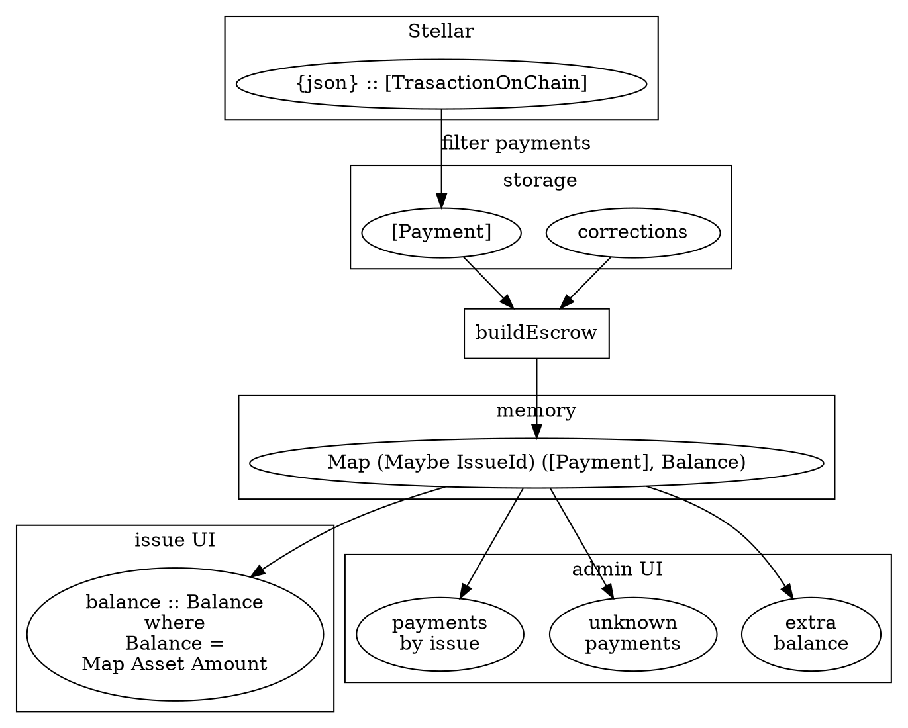

# Escrow

```graphviz
digraph {
    subgraph cluster_Stellar {
        label = Stellar;
        transactions_on_chain [label = "{json} :: [TrasactionOnChain]"];
    }

    transactions_on_chain -> storage_intermediate [label = "filter payments"];

    subgraph cluster_Veche_storage {
        label = storage;
        storage_intermediate [label = "[Payment]"];
        corrections;
    }

    buildEscrow [shape = box];

    storage_intermediate, corrections -> buildEscrow -> memory_intermediate;

    subgraph cluster_Veche_memory {
        label = memory;
        memory_intermediate [
            label = "Map (Maybe IssueId) ([Payment], Balance)",
        ];
    }

    memory_intermediate -> ui_issue_balance;

    subgraph cluster_Veche_UI {
        label = "issue UI";
        ui_issue_balance [
            label = "balance :: Balance\nwhere\nBalance =\nMap Asset Amount",
        ];
    }

    memory_intermediate
    -> payments_by_issue, unknown_payments, extra_balance;

    subgraph cluster_Veche_admin {
        label = "admin UI";
        payments_by_issue [label = "payments\nby issue"];
        unknown_payments [label = "unknown\npayments"];
        extra_balance [label = "extra\nbalance"];
    }
}
```

Transactions are grouped by issue.
